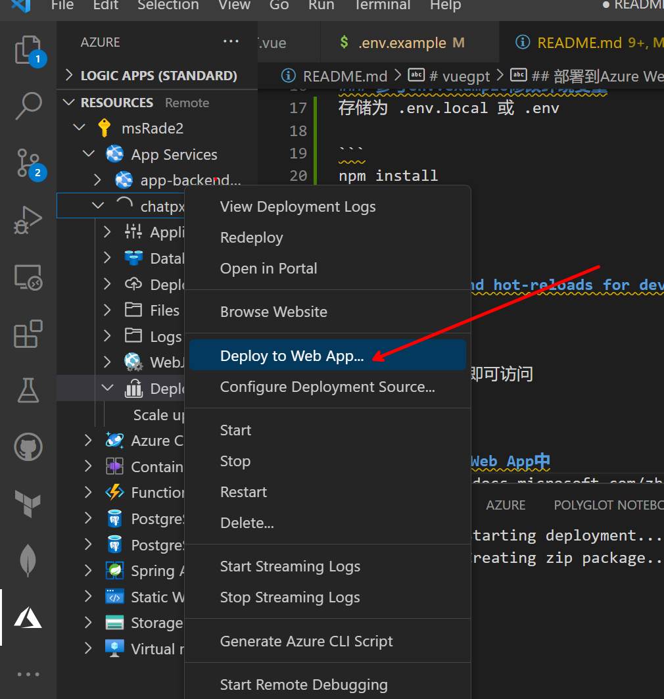

# vuegpt

Azure OpenAI的最基本的聊天客户端，使用Vue3.0开发，使用了Azure的认证和OpenAI的API，可以在Azure上部署，也可以在本地部署。
 - 支持响应格式化显示。
 - 支持流式(Stream)响应，加快响应显示速度。
 - 聊天记录没做任何处理，不会在服务器保留。可以本地浏览器按Ctrl + S保存聊天记录。

## 部署到本地


## Project setup
```
git clone https://github.com/radezheng/vuegpt
cd vuegpt
```
### 参考env.example修改环境变量
存储为 .env.local 或 .env

```
npm install
```


### Compiles and hot-reloads for development
```
npm run serve
```
按提示URL, 本地即可访问


## 部署到Azure Web App中
- 参考 https://learn.microsoft.com/zh-cn/azure/app-service/quickstart-nodejs?pivots=development-environment-vscode&tabs=linux#configure-the-app-service-app-and-deploy-code

- 最简单是用VS Code的Azure插件，直接部署到Azure Web App中。


或者使用ARM Template部署，参考 https://docs.microsoft.com/zh-cn/azure/azure-resource-manager/templates/template-tutorial-create-first-template?tabs=azure-cli
[](https://portal.azure.com/#create/Microsoft.Template/uri/https%3A%2F%2Fraw.githubusercontent.com%2Fradezheng%2Fvuegpt%2Fmain%2Fdeploy%2Fazuredeploy.json)


## 部署到Azure Static Web App需要使用github workflow
- 参考 https://learn.microsoft.com/zh-cn/azure/static-web-apps/build-configuration?tabs=github-actions
- 环境变量需要建在github secrets中:
 - - 在github中的项目页面，点击Settings，然后点击Secrets，添加环境变量，名称和.env中的名称一致，值为.env中的值。
```
          VUE_APP_OPENAI_API_KEY: ${{ secrets.VUE_APP_OPENAI_API_KEY }}
          VUE_APP_DEPLOYMENT_ID: ${{ secrets.VUE_APP_DEPLOYMENT_ID }}
          VUE_APP_MODEL_ID: ${{ secrets.VUE_APP_MODEL_ID }}
```

### Compiles and minifies for production
```
npm run build
```

### Lints and fixes files
```
npm run lint
```

### Customize configuration
See [Configuration Reference](https://cli.vuejs.org/config/).
